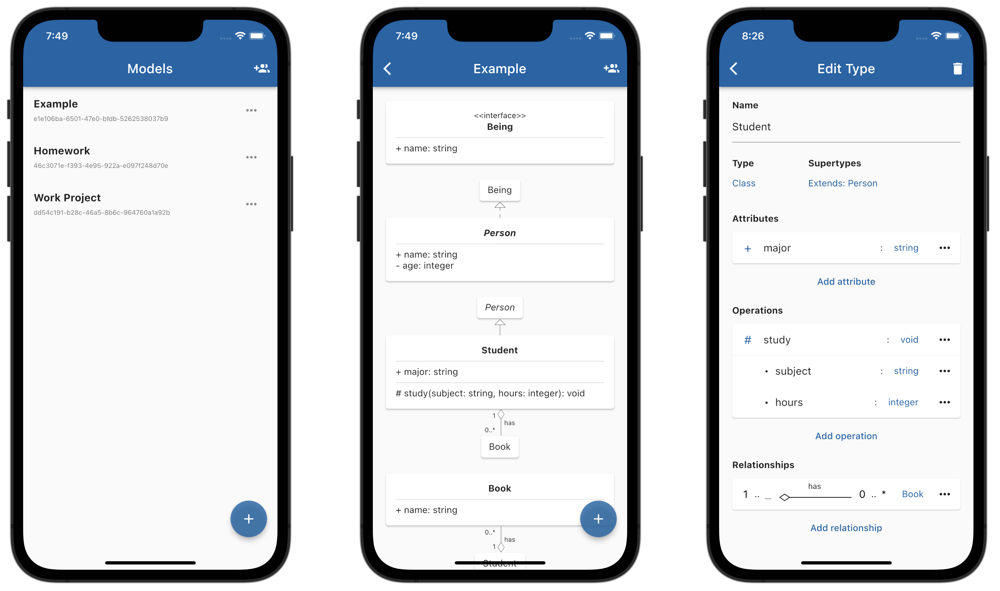

# CoMod

_CoMod_ is an Android/iOS application allowing teams to collaboratively model UML class diagrams in real time. A paper about it is currently being submitted to the [ECMFA 2022](https://davidediruscio.github.io/ECMFA2022/) conference. This repository contains all the resources required for running _CoMod_ and reproducing the paper's results.



The repository contains the following directories:

- [client](./client): _CoMod_'s [Flutter](https://flutter.dev)-based client application
- [client-js](./client-js): JavaScript code that runs within the client application
- [e2e-tests](./e2e-tests): the system's end-to-end tests
- [evaluation](./evaluation): code to evaluate _CoMod_'s performance characteristics
- [server](./server): _CoMod_'s [Node.js](https://nodejs.org/)-based server backend
- [protocol](./protocol): the [protobuf](https://developers.google.com/protocol-buffers)-based communication protocol between client and server
- [schema](./schema): the XML schema of the client application's data model

More information may be found in each directory's README file.

## Setup

Run the following script to install all components' dependencies.

```bash
./setup.sh
```

## Run CoMod

Start server:

```bash
cd server
npm start
```

Run client app:

```bash
cd client
flutter run
```

The app may be run on the Android emulator/iOS simulator or on a real device. Before running on a real device, make sure to adjust `_host` and `_port` in `client/lib/logic/collaboration/collaboration_session.dart`.

## Note on git history

This repository has been created from the original repository containing the preceding diploma thesis and its associated work. Although the thesis itself has been removed from the repository, references to it and the original repository's structure might still be found in some commit messages.
